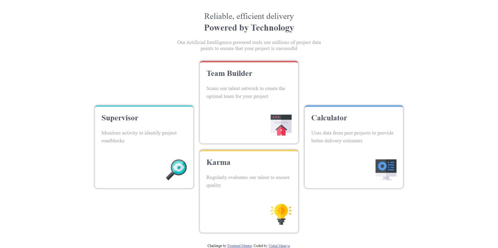
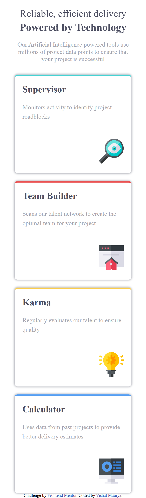

# Frontend Mentor - Four card feature section solution

This is a solution to the [Four card feature section challenge on Frontend Mentor](https://www.frontendmentor.io/challenges/four-card-feature-section-weK1eFYK). 

## Table of contents

- [Frontend Mentor - Four card feature section solution](#frontend-mentor---four-card-feature-section-solution)
  - [Table of contents](#table-of-contents)
  - [Overview](#overview)
    - [The challenge](#the-challenge)
    - [Screenshot](#screenshot)
    - [Links](#links)
  - [My process](#my-process)
    - [Built with](#built-with)
  - [Author](#author)

## Overview

### The challenge

Users should be able to:

- View the optimal layout for the site depending on their device's screen size

### Screenshot

### Links

- Solution URL: [Click Here](https://www.github.com/VishalMauryastp/four-card-feature-section-main)
- Live Site URL: [Click Here](https://vishalmauryastp.github.io/four-card-feature-section-main/)

## My process

### Built with

- Semantic HTML5 markup
- CSS custom properties
- Flexbox
- scss/sass
- Mobile-first workflow

## Author

- Github - [@VishalMauryastp](https://www.github.com/VishalMauryastp)
- Frontend Mentor - [@VishalMauryastp](https://www.frontendmentor.io/profile/VishalMauryastp)
- LinkedIn - [@Vishal Maurya](https://www.twitter.com/yourusername)

